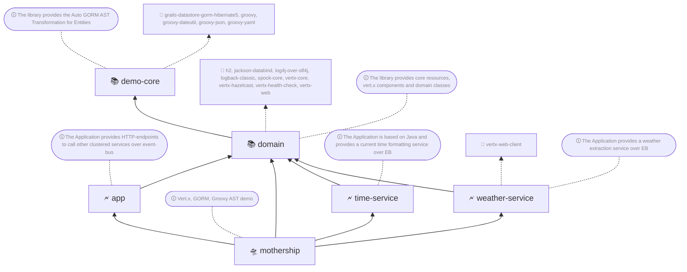

This is a super-cool Vert.x demo project!

```mermaid
flowchart BT
	classDef ext font-size:x-small, color:#888
	app-info(["`🛈 The Application provides HTTP-endpoints to call other clustered services over event-bus`"]):::ext
	app["🗲 app"]
	demo-core-ext["`🔗 grails-datastore-gorm-hibernate5, groovy, groovy-dateutil, groovy-json, groovy-yaml`"]:::ext
	demo-core-info(["`🛈 The library provides the Auto GORM AST Transformation for Entities`"]):::ext
	demo-core["📚 demo-core"]
	domain-ext["`🔗 h2, jackson-databind, log4j-over-slf4j, logback-classic, spock-core, vertx-core, vertx-hazelcast, vertx-health-check, vertx-web`"]:::ext
	domain-info(["`🛈 The library provides core resources,<br>vert.x components and domain classes`"]):::ext
	domain["📚 domain"]
	mothership-info(["`🛈 Vert.x, GORM, Groovy AST demo`"]):::ext
	mothership["🛸 mothership"]
	time-service-info(["`🛈 The Application is based on Java and provides a current time formatting service over EB`"]):::ext
	time-service["🗲 time-service"]
	weather-service-ext["`🔗 vertx-web-client`"]:::ext
	weather-service-info(["`🛈 The Application provides a weather extraction service over EB`"]):::ext
	weather-service["🗲 weather-service"]
	app -.- app-info
	app --> domain
	demo-core -.- demo-core-info
	demo-core .-> demo-core-ext
	domain -.- domain-info
	domain --> demo-core
	domain .-> domain-ext
	mothership -.- mothership-info
	mothership --> domain
	mothership --> app
	mothership --> time-service
	mothership --> weather-service
	time-service -.- time-service-info
	time-service --> domain
	weather-service -.- weather-service-info
	weather-service --> domain
	weather-service .-> weather-service-ext
```
